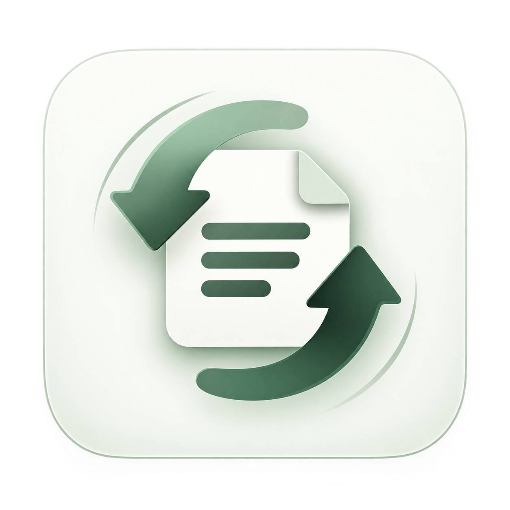

<div align="center">
  

  <h1>Anything Convertable</h1>

  <p><strong>New format. Same attention to detail.</strong></p>
  <p>Convert documents, images, and presentations—or turn your words into a document.<br />Five file converters. One Text Studio. A focused workspace.</p>

  <p>
    
    
    
    
    
  </p>

  <p>
    <a href="#features">Features</a> ·
    <a href="#quick-start">Quick start</a> ·
    <a href="#text-studio">Text Studio</a> ·
    <a href="#api">API</a> ·
    <a href="#project-structure">Project structure</a>
  </p>
</div>

---

## Overview

Anything Convertable brings everyday document tasks into a responsive web app. Choose a converter, upload a file, adjust the available settings, and download the result. For documents that start with an idea, Text Studio formats typed or pasted content into Word or PDF.

The interface uses a consistent light theme, dedicated tool pages, and shared navigation. Conversions run on the Python backend; the browser connects through a same-origin Next.js API proxy.

## Features

- **Five file converters** for images, PDFs, Word documents, and PowerPoint presentations.
- **Text Studio** with document presets, font controls, and custom page layouts.
- **OCR for scanned PDFs**, with recognized text and source images included in Word output.
- **Conversion controls** for supported font choices, selectable PDF text, and presentation fidelity.
- **Quality notes** that surface OCR uncertainty, fallback rendering, and output limitations.
- **Responsive navigation** with separate Home, Converter, Text Studio, FAQs, and Privacy pages.
- **Session conversion history** for downloading recent results while the workspace remains open.

### Supported conversions

| Tool | Input | Output |
| --- | --- | --- |
| Image to PDF | JPG, PNG, WEBP, TIFF, BMP, GIF | PDF |
| Word to PDF | DOCX | PDF |
| PDF to Word | Native or scanned PDF | DOCX |
| PowerPoint to PDF | PPTX | PDF |
| PDF to PowerPoint | PDF | PPTX |
| Text Studio | Typed or pasted text | DOCX, PDF |

## Quick start

Run the following commands from the repository root. You will need Node.js with npm, Python 3.11, and two terminal sessions. The backend container uses Python 3.11; the frontend dependencies are recorded in the npm lockfile.

### 1. Install document tools

For macOS with Homebrew:

```bash
brew install --cask libreoffice
brew install tesseract tesseract-lang
```

LibreOffice provides Office rendering and Text Studio PDF export. Tesseract provides OCR; install the language models used by your documents. For a container with these dependencies included, see [Backend container](#backend-container).

### 2. Start the API

```bash
python3 -m venv .venv
.venv/bin/pip install -r apps/api/requirements.txt
.venv/bin/uvicorn app.main:app --app-dir apps/api --port 8000
```

### 3. Start the web app

In a second terminal:

```bash
npm ci
npm --workspace apps/web run dev -- --hostname 0.0.0.0
```

| Service | Local address |
| --- | --- |
| Web app | <http://localhost:3000> |
| API documentation | <http://localhost:8000/docs> |
| API health | <http://localhost:8000/health> |

To access the app from a phone on the same network, open your computer's LAN address on port `3000`. Browser requests use `/api`, which Next.js forwards to the backend; the phone does not need to connect to its own `localhost`.

## Text Studio

Start with a **General document**, **Formal letter**, **Business report**, **ATS-friendly résumé**, or **Custom format**. Choose a title, font, size, and output format, then add your content.

```text
# Project overview
A short introduction to your project.

## Highlights
- First milestone completed
- Next release planned

# Next steps
Describe what happens next.
```

Headings (`#`, `##`, `###`) and bullet markers control structure. Familiar standalone résumé and report headings are also recognized. Supplied wording, names, dates, and figures are preserved rather than generated or rewritten.

Custom layouts support A4 or Letter pages, margins, line spacing, heading size and alignment, and an explicit section order. List an existing main heading per line to reorder sections; unlisted sections follow, while introductory content stays at the beginning.

Résumés use a single column without tables or text boxes, and their PDFs retain selectable text. This template does not provide an ATS score or job-match analysis. PDF export renders the generated Word document through LibreOffice for consistent formatting.

## Configuration

| Variable | Default | Purpose |
| --- | --- | --- |
| `API_INTERNAL_URL` | `http://127.0.0.1:8000` | Backend destination for the Next.js proxy. Set before building for a separate backend deployment. |
| `NEXT_PUBLIC_API_URL` | `/api` | Optional browser-facing API base URL. A separate origin needs appropriate CORS settings. |
| `LIBREOFFICE_PATH` | Auto-detected | Explicit path to the `soffice` executable. |
| `OCR_LANGS` | `eng+hin` | Requested Tesseract language models. |
| `MAX_UPLOAD_MB` | `100` | Backend upload limit in MB. The current interface advertises 50 MB. |

Install the source document's fonts on the server for the closest Office output. Arial, Calibri, Georgia, and Times New Roman are not bundled. The backend container supplies Liberation, Carlito, Noto, and the bundled Devanagari font; substitute fonts can change layout.

## Backend container

```bash
docker build -t anything-convertable-api apps/api
docker run --rm -p 8000:8000 anything-convertable-api
```

The image includes LibreOffice Writer and Impress, Tesseract English and Hindi models, and open fonts. It runs the API as a non-root user. Office jobs use isolated temporary profiles and a 180-second timeout. Validate the image in your deployment environment before release.

The frontend runs separately:

```bash
npm run build:web
npm --workspace apps/web run start
```

## API

Interactive request schemas are available at `/docs` on the API server.

| Method | Endpoint | Purpose |
| --- | --- | --- |
| `GET` | `/health` | Check service health. |
| `GET` | `/v1/conversions` | List supported conversions and capabilities. |
| `POST` | `/v1/detect` | Identify uploaded image, PDF, or Office content. |
| `POST` | `/v1/convert/{id}` | Convert a multipart `file` upload. |
| `POST` | `/v1/convert-text` | Create a document from JSON text and formatting options. |

File conversion IDs: `image_to_pdf`, `word_to_pdf`, `pdf_to_word`, `ppt_to_pdf`, and `pdf_to_ppt`.

```bash
curl -X POST 'http://localhost:8000/v1/convert/word_to_pdf' \
  -F 'file=@document.docx' \
  --output document.pdf
```

File conversions accept `font`, `searchable`, and `fidelity` query parameters where supported. For PDF-to-PowerPoint, `fidelity=appearance` preserves page appearance and `fidelity=editable` reconstructs editable text. The web app recommends appearance mode; the API defaults to editable mode for compatibility.

Text requests accept `text`, `to_format`, `font`, `font_size`, `searchable`, `template`, `title`, and `custom_format`. Template IDs are `general`, `formal`, `report`, `resume`, and `custom`.

Download responses expose `Content-Disposition`, `X-Elapsed-Seconds`, and JSON `X-Conversion-Warnings`. CPU-heavy conversion work runs outside the asynchronous request loop.

## Conversion fidelity

Output quality depends on the source document, installed fonts, OCR models, and rendering engine. The app reports limitations alongside results.

<details>
<summary><strong>Format-specific behavior and limitations</strong></summary>

| Conversion | Approach | What to expect |
| --- | --- | --- |
| Image to PDF | Preserves original JPEG streams where possible; supports alpha masks, EXIF orientation, DPI, multi-frame TIFF/GIF, and ICC-to-sRGB conversion. | Color conversion can alter pixel values. Image text remains an image. |
| Word to PDF | LibreOffice renders document structure and exports images without downsampling. | Missing fonts and unusual Office layouts can affect output. |
| PDF to Word | Uses pdf2docx for native pages and Tesseract for scanned pages, including mixed documents. | Layout is reconstructed. Scans include recognized text followed by the source image; font estimates and page counts may differ. |
| PowerPoint to PDF | LibreOffice renders slides, master layouts, shapes, charts, and selectable text. | Unsupported Office effects and font substitutions can change appearance. |
| PDF to PowerPoint | Appearance mode renders complete pages at up to 300 DPI; editable mode reconstructs native text over a graphics layer. | Appearance mode uses images. Graphics are not individually editable, and scanned or rotated pages remain images in editable mode. Mixed page sizes fit without stretching. |

Original font metadata is preserved where possible. Selecting a different font can change line breaks; scanned pixels do not identify an exact font family.

Legacy Office renderers remain available for file conversions when LibreOffice is missing and emit warnings. The fallback PowerPoint renderer produces image pages even when selectable text is requested. Text Studio PDF export requires LibreOffice and returns an actionable error if it is unavailable.

`searchable=false` rasterizes PDF pages at 300 DPI. Flattening is not encryption or tamper protection, and OCR can recover text. Failed PDF pages produce errors rather than being silently skipped.

</details>

## Project structure

```text
anything-editable/
├── apps/
│   ├── web/                    # Next.js frontend
│   │   ├── app/                # Pages, shared components, and styles
│   │   ├── public/             # Static assets and favicon
│   │   └── lib/                # Browser API client
│   └── api/                    # FastAPI backend
│       ├── app/conversions/    # Converters, OCR, fonts, and document templates
│       ├── fonts/              # Bundled Devanagari font
│       ├── tests/              # Conversion regression tests
│       └── Dockerfile          # Backend image with rendering dependencies
├── extension/                  # Browser extension workspace
├── packages/aedom/             # Shared document model package
└── package.json                # npm workspaces and build commands
```

The main website uses `/`, `/converters`, `/converters/[tool]`, `/text-studio`, `/faqs`, and `/privacy`. The extension and shared package have separate build commands: `npm run build:extension` and `npm run build:aedom`.

## Development and verification

```bash
# Backend regression tests
.venv/bin/python -B -m pytest -q apps/api/tests

# Frontend type check
npx tsc --noEmit -p apps/web/tsconfig.json

# Frontend production build
npm run build:web
```

The regression suite covers image preservation, transparency, orientation, multi-page images, slide graphics, mixed native/scanned PDFs, font overrides, content detection, and quality notes. Integration tests exercise Tesseract and LibreOffice when installed.

Before release, compare representative documents with their rendered sources, especially multi-column scans, mathematical notation, unusual scripts, and custom Office effects. Automated fixtures do not establish universal conversion accuracy.

## Contributing

Keep changes focused and include a clear description of the expected behavior. For conversion fixes, provide a small, non-sensitive reproduction file and the relevant output or quality notes. Run the applicable checks above and document any rendering dependencies needed to reproduce the result.

---

<div align="center">
  <p>Developed by <strong>Abhishek Tiwari</strong></p>
  <a href="https://www.linkedin.com/in/abhishek-tiwari-3a3594300/">Connect on LinkedIn</a>
</div>
